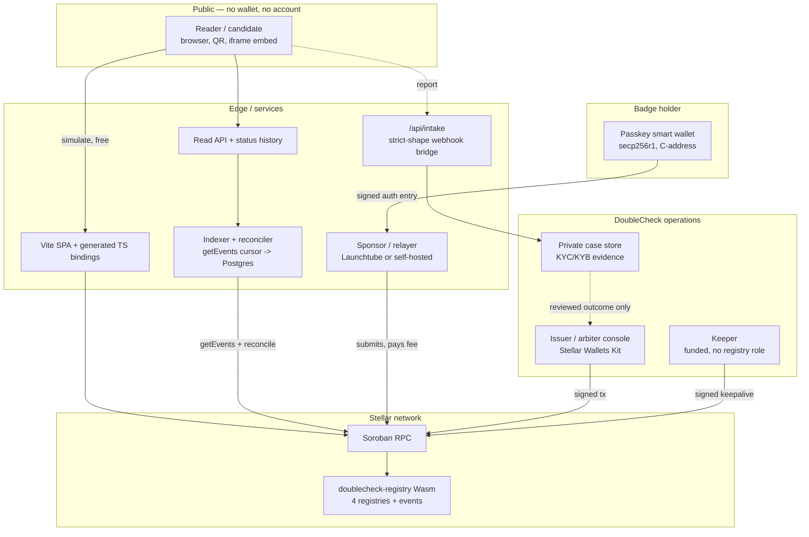
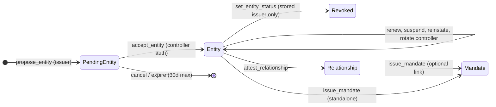
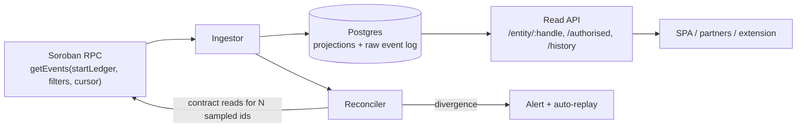

# Technical architecture — Stellar integration

**Project:** DoubleCheck — open trust infrastructure for company-signed relationships and
representation mandates.
**Steward and first verification issuer:** Jobited (Berlin, Germany).
**Model:** token-free, open source, multi-issuer by design, EU/GDPR-first.
**Target network:** Stellar Testnet (live) → Stellar Mainnet.

DoubleCheck is a public, wallet-free trust registry on Soroban. It answers three questions from one
link: **is this counterparty verified, is the stated affiliation supported, and is there a confirmed
mandate that is valid right now?** A candidate or customer gets that answer in seconds with no
wallet, no XLM and no blockchain knowledge; companies act through passkey-backed Soroban smart
accounts with role separation and multisig on sensitive actions.

This document is the Stellar-specific engineering reference. It is written so a reviewer can decide
whether this team can start building immediately: every claim below is either **live on public
testnet and independently checkable**, or specified down to the struct field, storage key,
authorisation rule, and function signature.

| Label | Meaning |
|---|---|
| **LIVE** | Deployed on Stellar testnet today. Verifiable at the contract address below. |
| **BUILD** | Grant scope. Designed, not yet written. Interfaces given. |
| **POLICY** | A decision that must be taken before mainnet, not a coding task. |

## 0. At a glance

| Item | Value |
|---|---|
| Chain | Stellar, Soroban, protocol 27 |
| Contract | `CDY4WIUWUJWDW4AKPTYFXTRONQQVS52PS2ZYFU2S5HEMW2U7LM5KRHKP` ([stellar.expert](https://stellar.expert/explorer/testnet/contract/CDY4WIUWUJWDW4AKPTYFXTRONQQVS52PS2ZYFU2S5HEMW2U7LM5KRHKP)) |
| Wasm SHA-256 | `1ab20ff8c30b0f704b64dee4aed5d1dd111e5b24e33fb612ef9309aef5dc895a` |
| Wasm size | 60,131 bytes optimised, against the 131,072-byte network limit |
| Upgrade tx | [`b0aaf6f…`](https://stellar.expert/explorer/testnet/tx/b0aaf6f31e942e619b393505f90f15d57c73404e2707bf688b5d3f56758b7940) — in-place upgrade, 10 Aug 2026, 5 entities and 8 claims preserved |
| Toolchain | Rust 1.96 · `soroban-sdk` 27.0.5 · target `wasm32v1-none` · `stellar-cli` |
| Contract tests | 59, deterministic, snapshot-backed |
| Live app | <https://doublecheck-lime.vercel.app> |
| Source | <https://github.com/zadworny/doublecheck> — [`SC/`](../SC/) contract, [`FE/`](../FE/) verifier |
| Docs | <https://doublecheck.gitbook.io/doublecheck/> |

Companion documents: [current-state architecture](architecture.md) · [contract interface](../SC/README.md) ·
[frontend](../FE/README.md) · [deployment and operations runbook](deployment.md) ·
[roadmap and release gates](roadmap.md) · [security boundary](../SECURITY.md).

---

## 1. Why Soroban, specifically

A database can render the same page. It cannot survive its own operator. The registry exists so that
a reader can establish, **without trusting doublecheck.com**, which key authenticated a statement and
what its status is right now. Five Stellar properties make that practical rather than theoretical:

1. **Free, wallet-free reads.** Soroban RPC `simulateTransaction` executes a contract read without a
   transaction, a fee, an account, or a signature. A candidate verifying a recruiter installs
   nothing. This is the single most important adoption property of the product and it is a platform
   feature, not something we build.
2. **Native secp256r1 (Protocol 21, CAP-0051).** The controller key of a verified person can be a
   Face ID / fingerprint credential in the device secure enclave. No seed phrase, no browser
   extension, no custody. On most chains this needs a bundler and a paymaster; on Stellar the host
   function is in the protocol.
3. **Signer-derived provenance.** Soroban's authorization framework binds a signature to an exact
   `(contract, function, args, nonce, signature-expiration-ledger)` invocation tree. That is what
   lets the contract stamp *who actually signed* a claim — the difference between "the company
   confirmed this" and "the recruiter says so" — and it is what makes a sponsored/relayed
   transaction safe (§6.4).
4. **Authentication delegation (Protocol 27 "Zipper", CAP-0071-01).** `delegate_account_auth` and the
   `SOROBAN_CREDENTIALS_ADDRESS_WITH_DELEGATES` credential bundle a tree of delegated signers into a
   **single** authorization entry. A company approval requiring two of three admins is therefore one
   transaction with one nonce and one simulation, rather than one authorization entry per signer.
   Multi-party corporate signing is a protocol feature here, not an application-layer workaround.
5. **Predictable, tiny fees for status writes.** Soroban's resource-based fee model prices an
   attestation as what it is — a handful of small ledger entries. A trust registry writes constantly
   (issue, confirm, suspend, expire, withdraw) and could not exist on a chain where each of those is
   priced like a token transfer.

**Signature-payload forward compatibility.** New work builds against
`SOROBAN_CREDENTIALS_ADDRESS_V2` (CAP-0071-02), whose payload is address-bound, rather than the
legacy V1 credential that is replaced at Protocol 28. This closes a cross-account signature-replay
class by construction and avoids a forced migration later.

What Stellar does not give us, and what this design therefore has to supply itself:

| Missing on Stellar | Consequence for this design |
|---|---|
| No ERC-721 / ERC-5484 | Soulbound is enforced by **absence of a transfer entry point**, not by overriding a hook. A badge is bound to `controller` at acceptance; the only movement path is a three-party issuer-reviewed recovery. |
| No Ethereum Attestation Service | **This contract is the attestation service.** `Relationship` and `Mandate` are first-class records with their own state machines rather than EAS schemas. One less external dependency; the semantics are ours. |
| No fixed-forever storage | Soroban charges rent and archives. The design has an explicit TTL layer and a permissionless keeper (§5). Most chains let you ignore this; here we cannot, and we do not. |

---

## 2. Topology



Three rules hold the topology together:

- **The read path never touches our servers.** `FE → RPC → contract` is a simulation. If our
  infrastructure disappears, a reader with the contract id and any public RPC still gets the same
  answer. The indexer/API is a *performance* layer, never an authority (§5.3).
- **Private evidence never touches the chain.** ID documents, liveness checks, KYB reports,
  complaint allegations, and review notes live in the private case store. The chain carries the
  *decision* and a hash.
- **A relayer can pay but cannot rewrite.** Fee sponsorship changes who pays and who sequences, never
  what was authorised (§6.4).

---

## 3. The four Soroban registries

The contract holds four record types with four independent lifecycles. They are described here as
"registries" because that is what they are functionally; they ship as **one Wasm** (§3.6).

Source of truth: [`SC/contracts/doublecheck-registry/src/types.rs`](../SC/contracts/doublecheck-registry/src/types.rs).



### 3.1 Registry 1 — Issuance (`PendingEntity`) · LIVE

A badge is never created by an issuer alone. The issuer commits the *exact* public record, credential
hash and terms hash on-chain; the badge does not exist until the named controller authenticates.
This is the on-chain consent record.

```rust
#[contracttype]
#[derive(Clone, Debug, PartialEq, Eq)]
pub struct PendingEntity {
    pub id: u64,
    pub kind: EntityKind,           // Organisation | Person
    pub controller: Address,        // the key that must accept
    pub handle: String,             // reserved on proposal
    pub display_name: String,       // forced empty for Person
    pub domain: String,             // forced empty for Person
    pub jurisdiction: String,       // forced empty for Person
    pub metadata_hash: BytesN<32>,  // SHA-256 of the off-chain credential
    pub metadata_uri: String,       // https:// or ipfs://, <= 256 bytes
    pub issuer: Address,
    pub terms_hash: BytesN<32>,     // hash of the exact accepted terms version
    pub proposed_at: u64,
    pub accept_by: u64,             // <= proposed_at + 30 days
    pub expires_at: u64,            // future badge expiry, > accept_by
}
```

| Entry point | Auth | Effect |
|---|---|---|
| `propose_entity(...) -> u64` | global admin | reserves handle + controller, writes proposal, emits `EntityProposed`. **No verified status is created.** |
| `accept_entity(pending_id) -> u64` | the exact `controller` | promotes to `Entity`, assigns permanent id, emits `EntityAccepted` linking `pending_id → entity_id` |
| `cancel_entity_proposal(caller, id)` | issuer **or** controller; any address once `accept_by` has passed | releases handle and controller reservation |
| `get_pending_entity`, `get_pending_entity_by_controller` | none (read) | lets the controller find its own offer without an id |

Why this matters for a trust product: an audit of `EntityProposed` → `EntityAccepted` pairs proves
that every live badge was **accepted by its subject against a named terms hash**, on-chain, before it
became public. No issuer can manufacture a verified identity for someone who never agreed.

### 3.2 Registry 2 — Entities (`Entity`) · LIVE

```rust
#[contracttype]
#[derive(Clone, Debug, PartialEq, Eq)]
pub struct Entity {
    pub id: u64,                    // sequential, stable forever
    pub kind: EntityKind,
    pub controller: Address,        // soulbound; no transfer entry point exists
    pub handle: String,             // 3..64, URL-safe, unique, verifier URL segment
    pub display_name: String,
    pub domain: String,
    pub jurisdiction: String,
    pub metadata_hash: BytesN<32>,  // non-zero enforced
    pub metadata_uri: String,
    pub issuer: Address,            // FIXED at acceptance — not the current global admin
    pub status: EntityStatus,       // Active | Suspended | Revoked  (Expired is derived)
    pub verified_at: u64,
    pub expires_at: u64,            // non-zero, <= 400 days out
    pub strikes: u32,               // upheld complaints; reputation collateral, no cash stake
}
```

Design decisions worth flagging to a reviewer:

- **`issuer` is per-record and immutable.** A later global-admin handover does **not** inherit
  authority over previously issued badges. Renewal, revocation, metadata replacement and recovery
  approval for badge *n* remain with the address that actually vetted it. This blocks the
  "buy the admin key, rewrite history" attack that a single global-owner design allows.
- **`Expired` is derived, never stored.** `effective_entity_status(entity, now)` applies
  `expires_at` at read time, so a badge stops verifying with **no transaction, no cron, no keeper**.
  Nothing has to remember to expire trust.
- **Natural-person descriptors are rejected at the contract boundary.** For `EntityKind::Person`,
  `display_name`, `domain` and `jurisdiction` must be empty (`Error::PersonalDataNotAllowed = 26`).
  The name lives in the erasable off-chain credential (§8). This is enforced by the contract, not by
  frontend convention.
- **Recovery is three-party.** `propose_controller` (current controller) → `approve_controller_rotation`
  (stored issuer, after off-chain recovery review) → `accept_controller` (destination). Replacing the
  proposal invalidates any prior approval. Neither the holder nor the issuer can move a badge alone.

Entry points: `accept_entity`, `register_entity` (legacy dual-auth), `update_metadata` (stored issuer
only), `renew_entity`, `set_entity_status`, `add_strike`, `propose_controller`,
`approve_controller_rotation`, `accept_controller`, `cancel_controller_rotation`, `rotate_controller`
(triple-auth compatibility path).

### 3.3 Registry 3 — Relationships (`Relationship`) · LIVE

"This person is / was affiliated with this organisation."

```rust
#[contracttype]
#[derive(Clone, Debug, PartialEq, Eq)]
pub struct Relationship {
    pub id: u64,                    // shares one id sequence with Mandate
    pub org: u64,
    pub person: u64,
    pub rel_type: RelationshipType, // CurrentEmployee | PastEmployee | CurrentContractor | …
    pub role: String,               // <= 128 bytes, required
    pub department: String,
    pub start_date: u64,            // never future-dated
    pub end_date: u64,              // 0 = ongoing
    pub status: ClaimStatus,
    pub confirmation: Confirmation, // derived from the signer, not supplied by the caller
    pub public_display: bool,       // subject consent gate
    pub detail_hash: BytesN<32>,
    pub confirmed_at: u64,
    pub attested_by: Address,       // the key that signed the write
}
```

Two properties do real work:

- **`confirmation` is derived from the authenticated signer**, never from an argument. The caller
  cannot self-declare a stronger tier. §4 has the table.
- **`public_display` is a consent gate the subject controls.** A company-attested affiliation starts
  unlisted. Only the subject (or admin) can publish it, and the public frontend omits unpublished
  relationships from snapshots, search, feeds and detail fetches. An employer cannot out someone.

Entry points: `attest_relationship`, `end_relationship`, `set_relationship_status`,
`set_public_display`, plus reads `get_relationship`, `relationship_status`,
`relationships_attested_by`, `relationships_about`.

### 3.4 Registry 4 — Mandates (`Mandate`) · LIVE

"This person or agency may act for this organisation, for this scope, until this date." This is the
product. Identity is table stakes; **authorisation** is what a candidate actually needs.

```rust
#[contracttype]
#[derive(Clone, Debug, PartialEq, Eq)]
pub struct Mandate {
    pub id: u64,
    pub org: u64,
    pub representative: u64,        // person or agency organisation
    pub relationship: u64,          // 0 = standalone, else must match the same pair
    pub mandate_type: MandateType,  // Recruitment | Sales | Consulting | …
    pub scope: String,              // required, <= 128 bytes
    pub territory: String,
    pub valid_from: u64,
    pub valid_until: u64,           // never 0 — mandates are always time-bound, <= 366 days
    pub status: ClaimStatus,
    pub confirmation: Confirmation,
    pub detail_hash: BytesN<32>,
    pub confirmed_at: u64,
    pub attested_by: Address,
}
```

Entry points: `issue_mandate`, `set_mandate_status`, reads `get_mandate`, `mandate_status`,
`mandates_issued_by`, `mandates_held_by`, and the predicate below.

### 3.5 `is_authorised` — the call the whole product rests on · LIVE

```rust
pub fn is_authorised(env: Env, org: u64, representative: u64) -> bool
```

One RPC simulation, no wallet, boolean answer. It deliberately checks far more than the mandate row:

```text
now := env.ledger().timestamp()

1. both entities exist, are Active after expiry derivation, and are not the same entity
2. scan ConfirmedPairMandates(org, rep) newest -> oldest, then the legacy PairMandates(org, rep),
   then the legacy PersonMandates(rep)                     [shared 128-record scan budget]
3. for each candidate mandate:
     - org and representative must match exactly
     - confirmation != SelfAsserted                        [self-assertion is evidence, never authority]
     - status == Active and valid_from <= now <= valid_until
     - if relationship != 0: that relationship must exist, match the same pair,
       have public_display == true, and be effectively active
4. true on the first candidate that passes; false otherwise
```

Consequences that fall out of this and are covered by named tests:

- Revoking a company invalidates every mandate it handed out **without enumerating them**, because
  step 1 fails.
- A newer *scheduled*, withdrawn, expired or self-asserted mandate cannot mask an older live
  confirmation, because the scan skips ineligible records instead of stopping at the newest.
- A mandate stops authorising the instant its window closes — no transaction required.
- The linked-relationship check means a mandate cannot outlive the affiliation it rests on, and
  cannot rely on a relationship the subject has withdrawn consent to publish.

The frontend verifier at `/verify` renders the badge, dates, confirmation tier and relationship
dependency, but **requires the deployed contract's own `is_authorised` result** before showing its
strongest verdict. A UI-derived check is never treated as proof.

### 3.6 One Wasm, not four contracts

| Consideration | Why one contract wins here |
|---|---|
| Atomicity | `accept_entity` writes the entity, handle index, controller index and clears three proposal keys in one invocation. Cross-contract that is a multi-call saga with partial-failure states. |
| Read cost | `is_authorised` touches the mandate, its relationship and both entities. Same-contract storage reads stay inside one footprint; cross-contract adds invocation overhead against the same ledger-footprint ceiling. |
| Auth surface | Every cross-contract boundary is a place to get `require_auth` wrong. Four boundaries is four audit surfaces. |
| Size budget | 60,131 of 131,072 bytes used. There is no size pressure forcing a split. |

The registries are separated by `DataKey` variant, id space and lifecycle instead — which gives the
isolation without the distributed-systems cost. Entities have their own counter; relationships and
mandates **share one claim-id sequence**, so a single id is enough to resolve a claim of either type.

---

## 4. Authorisation and the confirmation tiers · LIVE

Every write calls `require_auth()` on a specific `Address`. Soroban binds that signature to the exact
invocation tree, so there is no approve-then-drain pattern and no blanket allowance.

The contract then records **who signed** rather than what the caller claimed:

| Authenticated signer | Recorded `confirmation` | Weight in `is_authorised` |
|---|---|---|
| subject / representative controller | `SelfAsserted` | visible evidence only — **never** authorises |
| organisation controller | `CounterpartyConfirmed` | authorises |
| global admin or issuer | `IssuerConfirmed` | authorises |

`IssuerConfirmed` is the commercial unlock: it onboards a hiring company that has no wallet and no
intention of getting one — DoubleCheck verifies the domain/KYB out of band and signs. It is a
*distinguishable* tier, so a reader can see the difference, and the admin cannot make its own
statement look counterparty-confirmed.

### Roles and their ceilings

| Role | Can | Cannot |
|---|---|---|
| global admin | propose badges, record issuer-confirmed claims, set arbiter, pause, upgrade | touch badges issued before its handover; fake `CounterpartyConfirmed` |
| stored badge issuer (per record) | renew, revoke, suspend, replace metadata anchor, approve recovery, add strikes for **its** badge | act on another issuer's badge |
| entity controller | accept badge, attest in its role, withdraw claims about itself, propose its own rotation | activate, confirm, or strengthen a claim about itself |
| arbiter | record complaint outcomes, strikes, disputes, suspensions | revoke, strengthen a claim, or lift a suspension **it did not place** |
| keeper | submit and pay for bounded `keepalive` | anything with a registry effect |

Terminal states are terminal: `Revoked` (entity), `Ended`/`Withdrawn` (relationship),
`Completed`/`Withdrawn` (mandate). A renewed assertion is a **new claim**, never a silent
resurrection of an old one. Pause blocks new onboarding and new claims while leaving every takedown
path open — an emergency stop must never be a way to prevent a revocation.

---

## 5. Persistent storage and TTL management · LIVE

This is the part of Soroban that punishes teams who discover it in month four. It is designed for
here, not patched later.

### 5.1 Storage layout

Configuration lives in **instance** storage so it is bumped with the contract itself. Records live in
**persistent** storage. Nothing uses temporary storage.

| `DataKey` variant | Storage | Holds |
|---|---|---|
| `Admin`, `PendingAdmin`, `Arbiter`, `Paused` | instance | governance |
| `EntityCount`, `PendingEntityCount`, `ClaimCount` | instance | monotonic id counters |
| `Entity(u64)`, `PendingEntity(u64)`, `Relationship(u64)`, `Mandate(u64)` | persistent | the four registries |
| `HandleIdx(String)`, `ControllerIdx(Address)` | persistent | uniqueness — one handle, one badge per key |
| `PendingHandleIdx`, `PendingControllerIdx` | persistent | proposal reservations |
| `OrgRels`, `PersonRels`, `OrgMandates`, `PersonMandates` | persistent | discovery indexes, capped at 512 ids |
| `PairMandates(org, rep)`, `ConfirmedPairMandates(org, rep)` | persistent | authorisation indexes, capped at 64 live/scheduled |
| `LiveMandate(org, rep)` | persistent | fast hint, never authoritative |
| `PendingController(u64)`, `ApprovedController(u64)`, `EntitySuspendedBy(u64)` | persistent | recovery and suspension provenance |

Network limits the layout is designed against (measured on mainnet, not quoted):

| Setting | Value | Design consequence |
|---|---|---|
| `contract_max_size_bytes` | 131,072 | 60,131 used — room for the OZ governance layer in §7 |
| `contract_data_entry_size_bytes` | 65,536 | caps ids per index vector → the 512 bound |
| `contract_data_key_size_bytes` | 250 | handles capped at 64 bytes, comfortably inside |
| `min_persistent_ttl` | 2,073,600 ledgers (120 d) | the TTL floor every new entry gets |
| `max_entry_ttl` | 3,110,400 ledgers (180 d) | **no entry can be made to live longer than 180 days** |

That last row is the one that matters: a 400-day badge outlives the maximum possible lifetime of the
ledger entry holding it. Storage survival and business validity are **independent problems**, and the
contract treats them that way.

### 5.2 TTL policy

[`storage.rs`](../SC/contracts/doublecheck-registry/src/storage.rs) routes every access through
helpers that request an extension on what they touch:

```rust
pub const DAY_IN_LEDGERS: u32   = 17_280;              // ~5s close time
pub const EXTEND_TO: u32        = 120 * DAY_IN_LEDGERS; // exactly min_persistent_ttl
pub const EXTEND_THRESHOLD: u32 = 45  * DAY_IN_LEDGERS; // top up below 45 days remaining

fn extend_record(env: &Env, key: &DataKey) {
    env.storage().persistent().extend_ttl(key, EXTEND_THRESHOLD, EXTEND_TO);
}
```

Extending to exactly the network minimum is valid on **every** network without tracking each one's
ceiling, and it is cheaper rent than pushing to the maximum.

**The trap, stated explicitly:** a simulated read executes that extension code, but simulation
results are discarded. Public verifier traffic therefore does **not** keep records alive. Only a
signed, submitted transaction commits a TTL change. An earlier iteration of this design assumed
"reads pay for storage"; that assumption is wrong and has been removed from the codebase and the
docs.

### 5.3 The keeper

```rust
pub fn keepalive(env: Env, entity_cursor: u64, claim_cursor: u64, limit: u32)
    -> Result<KeepaliveResult, Error>   // limit ∈ 1..=50, else Error::InvalidBatchSize
```

Permissionless — it holds no registry role and can change no trust state; the transaction source pays
the fee. Each call touches a bounded slice: for each entity, its record plus handle index, controller
index, suspension provenance, pending/approved controller and all four discovery indexes; for each
claim, its record plus the pair and confirmed-pair indexes. It returns a resumable cursor:

```rust
pub struct KeepaliveResult {
    pub next_entity: u64, pub next_claim: u64,
    pub entities_touched: u32, pub claims_touched: u32,
    pub done: bool,
}
```

Operations run it from a dedicated funded source on a monitored schedule until `done`, with alerting
on the source balance.

### 5.4 What archival actually costs — and the asymmetry nobody documents

Since **Protocol 23 (CAP-0066)**, archived persistent and instance entries are restored
**automatically** before a host function runs, provided they appear in the transaction's restore
list — and simulation through Stellar RPC populates that list for you. For anything that submits a
transaction, an archived DoubleCheck record is therefore a **fee event, not an outage**. Restored
entries are priced as disk data (rent, read and write fees still apply), and `RestoreFootprintOp`
remains available for bulk restoration or where we would rather absorb the cost than pass it to a
user.

**But that relief does not reach the read path, and this is the asymmetry that matters here.** The
public verifier does read-only simulation: it never submits, so it can never carry a restore list. An
archived entry is a genuine outage for exactly the traffic this product exists to serve — a candidate
checking a recruiter, with no wallet and nothing to sign.

Three consequences:

1. The keeper stays essential. Auto-restore reduces archival to an accounting problem for writers; it
   does nothing for readers.
2. The verifier must distinguish "archived, restorable" from "no such record" and render a
   *restoring* state, never a false negative. Showing "not verified" for an archived badge would be
   the single worst failure this system can produce.
3. Operations can restore on the reader's behalf: the verifier reports the archived key, the TTL
   service submits the restore, and the page resolves. The reader still signs nothing.

**BUILD — TTL service.** A scheduled worker that (a) drives `keepalive` to completion on a cadence
derived from `EXTEND_THRESHOLD`, (b) monitors per-entry TTL through RPC `getLedgerEntries`,
prioritising contract instance/code entries and active records, (c) submits restores for archived
entries a reader requested, and (d) exports rent spend, TTL headroom and **the minimum TTL across the
whole estate** as a monitored metric — one number that tells operations whether the registry is
healthy. Budgeted in §13.

---

## 6. Events and the off-chain indexer

### 6.1 Event schema · LIVE

Every state change emits a typed `#[contractevent]`. With `soroban-sdk` 27 the emitted shape is
deterministic and machine-readable:

- **topic[0]** = the struct name in `snake_case` as a `Symbol` (`EntityRegistered` →
  `entity_registered`)
- **topic[1..]** = each `#[topic]` field, in declaration order
- **data** = a map of the remaining fields keyed by field name (sorted), so consumers are not
  positional and a later added field does not shift existing ones

This is exactly what an indexer wants: `getEvents` can filter server-side on topic[0] for the event
type and on topic[1..] for the subject.

| Event | topic[0] | Indexed topics | Body |
|---|---|---|---|
| `EntityProposed` | `entity_proposed` | `pending_id`, `kind`, `controller` | handle, issuer, metadata_hash, terms_hash, accept_by, expires_at |
| `EntityAccepted` | `entity_accepted` | `pending_id`, `entity_id`, `controller` | issuer, metadata_hash, terms_hash, accepted_at |
| `EntityProposalCancelled` | `entity_proposal_cancelled` | `pending_id` | by |
| `EntityRegistered` | `entity_registered` | `id`, `kind`, `controller` | handle, issuer, verified_at, expires_at |
| `EntityStatusSet` | `entity_status_set` | `id`, `status` | expires_at, by |
| `MetadataUpdated` | `metadata_updated` | `id` | metadata_hash, metadata_uri, by |
| `ControllerRotationProposed` | `controller_rotation_proposed` | `id`, `current_controller`, `proposed_controller` | — |
| `ControllerRotationApproved` | `controller_rotation_approved` | `id`, `proposed_controller` | approved_by |
| `ControllerRotationCancelled` | `controller_rotation_cancelled` | `id`, `proposed_controller` | cancelled_by |
| `ControllerRotated` | `controller_rotated` | `id`, `old_controller`, `new_controller` | — |
| `StrikeAdded` | `strike_added` | `id` | strikes, by |
| `RelationshipAttested` | `relationship_attested` | `id`, `org`, `person` | rel_type, public_display, confirmation, attested_by |
| `RelationshipEnded` | `relationship_ended` | `id` | end_date, by |
| `PublicDisplaySet` | `public_display_set` | `id` | public_display, by |
| `MandateIssued` | `mandate_issued` | `id`, `org`, `representative` | mandate_type, valid_from, valid_until, confirmation, attested_by |
| `ClaimStatusSet` | `claim_status_set` | `id`, `status` | by |
| `AdminProposed` / `AdminAccepted` | `admin_proposed` / `admin_accepted` | both addresses | — |
| `ArbiterSet` | `arbiter_set` | `arbiter` | by |
| `PauseSet` | `pause_set` | `paused` | by |
| `ContractUpgraded` | `contract_upgraded` | — | wasm_hash, by |

`ClaimStatusSet` is the revocation feed: it is what a browser extension or a partner's cache watches
to invalidate a "verified" impression the moment it stops being true.

No event carries application text, complaint allegations, or personal evidence — only ids, addresses,
enums, timestamps and hashes.

### 6.2 Indexer and reconciler · BUILD

Today the explorer reconstructs the registry by walking counters and fetching records. That is honest
at 5 entities and unacceptable at 5,000. The replacement:



**Two ingestion paths, because RPC is not an archive.** An RPC node retains events only for a bounded
window (a configured ledger-retention setting, on the order of days) and cursors are per-endpoint.
Treating RPC as the historical source is the standard way these systems lose data, so there are two
paths from day one:

1. **Live path.** A single-writer worker polls `getEvents` from a persisted `(ledger, cursor)` pair,
   filtered to the contract id, and must never fall further behind than the retention window.
2. **Backfill / disaster path.** Replay raw ledger metadata from a
   [Galexie](https://developers.stellar.org/docs/data/indexers/build-your-own/galexie/admin_guide/full-history-exporting)
   data lake (S3/GCS) using the
   [ingest SDK](https://developers.stellar.org/docs/data/indexers/build-your-own/ingest-sdk). This
   makes the projections rebuildable from contract genesis with **no RPC history at all** — the
   answer to a corrupted database, a schema migration, or an ingestor that was down longer than the
   retention window.

**Idempotency.** The primary key of every ingested row is `(ledger_seq, tx_index, event_index)`, so
re-ingestion — after a crash, a replay, or an overlapping backfill — is a no-op rather than a
duplicate. This is what makes path 2 safe to run against a live path 1.

**Storage.** Two layers: an append-only `events` table (ledger, tx hash, event index, topics, body
JSON) which is the audit log and replay source, and derived projections (`entities`,
`relationships`, `mandates`, `status_history`) rebuilt by replaying `events` from zero. Every
projection row carries `last_event_ledger` so staleness is visible in the API response rather than
hidden.

**Finality.** Stellar has deterministic single-slot finality via SCP — there are no reorgs to unwind.
The ingestor still records `ledger_sequence` per event and only serves data at or below the latest
ledger it has fully ingested, so a partially processed ledger is never half-visible.

**Reconciliation — why the indexer can never lie.** On a schedule, the reconciler picks a rolling
sample plus every entity touched in the last window, re-reads authoritative state through
`getLedgerEntries` and the contract's own `check(handle)`, `get_entity`, `get_mandate` and
`is_authorised`, and diffs against the projection. Divergence raises a drift alert, marks the
affected public record **stale rather than serving a value the chain does not support**, and triggers
a targeted replay. The API surfaces `source: "indexed" | "chain"` and the verdict path for
`is_authorised` **always** re-reads the contract directly. The indexer accelerates browsing; it never
gets to decide whether someone is authorised.

**The alarm is tested, not assumed.** A deliberate-drift test — mutate a projection row by hand,
assert the reconciler alerts and marks it stale within one cycle — is an acceptance criterion of the
indexer milestone. An unverified monitoring path is indistinguishable from no monitoring.

**Why this design and not a subgraph.** There is no hosted indexing service on Stellar to depend on,
and depending on one would reintroduce exactly the "trust the operator" problem the chain is here to
remove. A ~600-line worker with a reconciler is a smaller liability than a third party in the trust
path.

---

## 7. Accounts, wallets and transaction submission

### 7.1 The read path takes no wallet · LIVE

```ts
// FE/src/lib/chain.ts — deliberately no publicKey, so the generated SDK uses its
// simulation-only null account instead of trying to load an address from RPC.
client ??= new Client({
  contractId: chainConfig.contractId,
  networkPassphrase: chainConfig.networkPassphrase,
  rpcUrl: chainConfig.rpcUrl,
});
```

`/verify`, `/badge/<handle>`, handle pages, search and the credential panel run entirely on
simulation. Zero fee, zero signature, zero install. This is non-negotiable product design: the badge
is worthless if a candidate has to acquire a wallet to check a recruiter.

**What the page must say, not just compute.** The verifier renders current relationships, historical
relationships, active and expired mandates, the issuer, the attesting key, validity dates and the
last confirmation. The hardest part is not the query — it is the wording of the case that misleads
people most often, which the UI states explicitly rather than leaving to inference:

> **Past employee.** This organisation confirms employment during the displayed period. This does
> **not** provide current authority to represent the organisation.

A stale affiliation presented as current authority is the most common real-world scam pattern in this
domain, and it is a copy problem as much as a contract problem.

**The badge is dynamic, which is what makes it uncopyable.** `/badge/<handle>` re-reads live state and
turns non-green the moment a relationship ends, a mandate expires, authority is withdrawn, a
credential is suspended, or the issuing organisation goes inactive. Responses are `no-store`. A
screenshot cannot fake this, because the colour is a function of a live response, and that response
is a function of contract state — which is precisely why the system ships **no** frozen "verified"
artefacts anywhere, including QR codes and share links.

**Performance targets:** verifier p95 under two seconds at pilot load; a status change visible within
about a minute of the confirming transaction; 30-second edge cache TTL on public reads.

### 7.2 Stellar Wallets Kit in the operator console · BUILD

Today's holder dashboard is Freighter-only via `@stellar/freighter-api`. Grant scope replaces the
wallet layer with **[Stellar Wallets Kit](https://stellarwalletskit.dev/)**
(`@creit-tech/stellar-wallets-kit`), focusing on **Freighter and xBull** as required, with the other
modules available at no extra integration cost.

```ts
import {
  StellarWalletsKit, WalletNetwork, allowAllModules, FREIGHTER_ID,
} from '@creit-tech/stellar-wallets-kit';

const kit = new StellarWalletsKit({
  network: WalletNetwork.TESTNET,          // PUBLIC on mainnet; must equal the binding passphrase
  selectedWalletId: FREIGHTER_ID,
  modules: allowAllModules(),              // Freighter, xBull, Albedo, Lobstr, Hana, Rabet, …
});

await kit.openModal({
  onWalletSelected: async ({ id }) => {
    kit.setWallet(id);
    const { address } = await kit.getAddress();
    // network re-checked against chainConfig.networkPassphrase before any write
  },
});

const { signedTxXdr } = await kit.signTransaction(xdr, {
  address,
  networkPassphrase: chainConfig.networkPassphrase,
});
```

Where it is used and where it is not:

| Surface | Wallet |
|---|---|
| public verifier, embeds, search | **none** — simulation only |
| issuer / arbiter console (propose, renew, revoke, strike, pause, upgrade) | Stellar Wallets Kit → Freighter or xBull, backed by a 2-of-3 account (§8) |
| holder dashboard, expert path | Stellar Wallets Kit |
| holder dashboard, mainstream path | Passkey smart wallet (§7.3) |

The write flow is unchanged and stays strict: check wallet → check network passphrase against the
binding → check the on-chain controller matches the connected address → render the exact statement
being signed in plain language → simulate → sign → submit → **wait for final ledger inclusion**. A
successful simulation is never reported as success. `signAuthEntry` is used where only an
authorisation entry is needed rather than a whole transaction — that is the hook the sponsored path
in §7.4 and SEP-45 in §7.5 both rely on.

### 7.3 Passkey smart accounts · BUILD

The adoption blocker is real: a recruiter will not install a browser extension and will not keep a
seed phrase. Stellar solved this at the protocol level, so we consume it rather than build it.

**Mechanism.** Protocol 21 (CAP-0051) added native `secp256r1` verification as a host function.
secp256r1 is the curve behind WebAuthn, so a device passkey — Face ID, Touch ID, Windows Hello,
Android biometrics — can be a signer for a Soroban **contract account** (`C…`). The wallet contract
implements `CustomAccountInterface::__check_auth`, receiving the signature payload, the signatures,
and the invocation tree being authorised.

**Integration.** [Passkey Kit](https://github.com/stellar/passkey-kit) supplies the client SDK, the
deployer factory and the policy-signer contracts. We do not fork it.

```ts
import { PasskeyKit } from 'passkey-kit';

const account = new PasskeyKit({
  rpcUrl, networkPassphrase, walletWasmHash: WALLET_WASM_HASH,
});

// Onboarding: one biometric prompt, no seed phrase, no funding step for the user.
const { contractId, signedTx } = await account.createWallet('DoubleCheck', handle);
await sponsor.send(signedTx);            // §7.4 pays and submits

// Returning: WebAuthn assertion over the exact invocation.
await account.connectWallet();
const signed = await account.sign(txn, { keyId });
```

**How it lands in the registry.** The resulting `C…` address is used as the `controller` of a
`PendingEntity`. No contract change is needed: `controller: Address` is already address-kind
agnostic, `require_auth` dispatches to `__check_auth` for contract accounts, and `accept_entity`
works identically. The one place it shows up is UX — the frontend must display and resolve `C…`
controllers as well as `G…` ones.

**Recovery, two independent layers.** These are deliberately not the same mechanism:

| Layer | Failure it covers | Mechanism |
|---|---|---|
| wallet | one device lost | multiple passkey signers registered per wallet + an ed25519 recovery signer held by the user or a chosen guardian |
| registry | all keys lost | the existing three-party `propose_controller` → `approve_controller_rotation` → `accept_controller` flow, gated on the stored issuer's off-chain re-verification |

The second layer is why key loss is not badge loss, and why the issuer cannot quietly move a badge
either.

**Policy signers — least privilege for a trust registry.** A policy contract can restrict a signer to
a specific contract, function set and validity window. Applied here:

| Signer | Allowed to call | Scope |
|---|---|---|
| device passkey | any registry function the controller may call | full |
| session/policy signer | `attest_relationship`, `set_public_display`, `set_relationship_status` | our contract id only, time-boxed |
| recovery ed25519 | rotation flow only | — |

A stolen session key can therefore never revoke a badge or accept a controller rotation. This is the
kind of blast-radius control a trust registry should have and a plain EOA cannot express.

**Organisation accounts get a policy matrix, not one key.** An individual's wallet is a passkey and a
recovery signer. A company account additionally carries policies from OpenZeppelin's
[`stellar-accounts`](https://crates.io/crates/stellar-accounts) smart-account framework, which
separates *who may sign* (signers), *what they may do* (context rules) and *how it is enforced*
(policies). Applied to the registry's action classes:

| Action class | Policy |
|---|---|
| read-only console views | no signature |
| propose a relationship, draft a mandate | 1 admin passkey |
| activate/end a relationship, activate/withdraw a mandate | 1 admin passkey — alerted and audit-logged |
| add or remove an admin, rotate the organisation key, change the organisation's registry controller | **2-of-3 multisig policy** |

The bottom row is the one that stops a single compromised laptop from handing a company's
representation authority to an attacker. Under Protocol 27 those two-of-three signatures bundle
through `delegate_account_auth` into one `SOROBAN_CREDENTIALS_ADDRESS_WITH_DELEGATES` entry: one
transaction, one nonce, one simulation. Before Zipper this pattern cost an authorization entry per
signer and was the reason most projects quietly settled for a single admin key.

### 7.4 Sponsored transactions · BUILD

Three distinct mechanisms, used for three distinct problems. They are often conflated; they are not
interchangeable.

| Mechanism | Solves | Where used |
|---|---|---|
| **Relayed submission** ([Launchtube](https://github.com/stellar/launchtube) or [OpenZeppelin Relayer](https://github.com/OpenZeppelin/openzeppelin-relayer)) | contract-account user has no XLM and no sequence number | passkey holder writes |
| **Fee-bump transaction** (CAP-15) | classic `G…` user has an account but no XLM for fees | expert/legacy holder writes |
| **Sponsored reserves** (CAP-33, `begin/endSponsoringFutureReserves`) | classic account creation and its base reserve | only where a `G…` account must exist at all |

**No end user ever needs XLM.** The platform's transaction service builds the invocation, simulates
it through RPC (which also populates any restore list, §5.4), then submits it with a platform fee
source. Default path: [Launchtube](https://github.com/stellar/launchtube), the SDF-operated service
that accepts a signed Soroban transaction or auth entry and handles fee and sequence. Fallback and
mainnet-grade path: a self-hosted [OpenZeppelin Relayer](https://github.com/OpenZeppelin/openzeppelin-relayer)
holding a funded submitter account. Both sit behind one interface so they are swappable, and
[`stellar-fee-abstraction`](https://crates.io/crates/stellar-fee-abstraction) is the contract-side
option if fee payment ever needs to be expressed on-chain rather than in the relayer.

**The invariant that makes this safe, and how it is enforced.** Soroban authorization is a signature
over a `SorobanAuthorizationEntry`: the authorising address, a nonce, a signature-expiration ledger,
and the **entire invocation tree** — contract id, function name and argument values, including
sub-invocations. The relayer supplies the transaction envelope, the source account, the sequence
number and the fee. It cannot alter the contract called, the function, or a single argument without
invalidating the user's signature, and it cannot replay the entry because the nonce is consumed
on-chain.

So the relayer's worst-case behaviour is bounded to: **refuse to submit**, or **delay submission**
(bounded by the signature-expiration ledger the client sets). Both are availability problems with a
clean answer — the console always offers "sign and submit yourself" as a fallback, and the holder can
pay their own fee. Neither is an integrity problem. That distinction is why fee sponsorship is
acceptable in a system whose entire value is that nobody can rewrite a trust decision.

Additional controls: rate limits **per organisation and per subject**, an allowlist restricted to the
registry contract id and the holder-callable function set, refusal of any invocation tree touching
admin functions, and a funded-balance alert. Every sponsored invocation is written to the audit log
**with its resource fee**, so sponsor abuse is a visible, bounded and costed line item rather than a
surprise at the end of the month.

### 7.5 SEP-10 and SEP-45 session authentication · BUILD

The public product needs no login. The **private** surfaces do: the reviewer console, the case store,
the holder's own private view, and any partner API key issuance. Those need "prove you control this
address" — which is exactly what the SEPs standardise, so we do not invent a bespoke signature login.

| Standard | Address type | Flow |
|---|---|---|
| **[SEP-10](https://developers.stellar.org/docs/learn/fundamentals/stellar-ecosystem-proposals#sep-0010---stellar-web-authentication)** | `G…`, `M…` | server builds a challenge transaction (sequence 0, manage-data ops, server-signed) → client signs → server verifies signatures and thresholds → JWT |
| **[SEP-45](https://github.com/stellar/stellar-protocol/blob/master/ecosystem/sep-0045.md)** (Draft) | `C…` — contract and passkey accounts | server returns XDR auth entries for a `web_auth_verify` invocation → client verifies contract, function and arguments (account, home domain, web auth domain, nonces) and the server signature → client signs the auth entries with its contract-account credentials → server simulates, verifies, issues JWT |

Both are needed, because our two user classes have different address types: SEP-10 alone cannot
authenticate a passkey wallet, and SEP-45 alone cannot authenticate a Freighter user. Server config
is published in `stellar.toml` (`WEB_AUTH_ENDPOINT`, `WEB_AUTH_FOR_CONTRACTS_ENDPOINT`,
`WEB_AUTH_CONTRACT_ID`, `SIGNING_KEY`). JWT lifetime is short with rotation, and claims carry the
address plus role, never verification evidence.

Because SEP-45 is a **Draft**, the implementation isolates it behind one server module and one client
adapter so a spec revision is a contained change. Session auth is deliberately separate from contract
authorisation: a JWT gets you into a console, and every privileged registry write still requires its
own Soroban signature over its own invocation. A stolen session token cannot write to the chain.

---

## 8. Governance, upgradeability and key custody · BUILD

Current state is honest but not mainnet-grade: hand-rolled `Admin`/`Arbiter`/`Paused` keys, a
two-step admin handover, and an immediate `upgrade(wasm_hash)`. Grant scope replaces the hand-rolled
parts with audited library code and adds the two controls a trust registry must have — **distributed
custody** and **a delay before the code can change**.

### 8.1 OpenZeppelin `stellar-contracts`

[OpenZeppelin's Stellar library](https://github.com/OpenZeppelin/stellar-contracts) is audited and
published on crates.io. Using it rather than hand-rolled admin logic removes both a maintenance
burden and an audit surface:

```toml
[dependencies]
soroban-sdk            = "27.0.5"
stellar-access         = "0.7"   # AccessControl, Ownable, role transfer
stellar-contract-utils = "0.7"   # pausable, upgradeable, cryptography
stellar-governance     = "0.7"   # governor, votes, timelock
stellar-accounts       = "0.7"   # smart accounts: signers, context rules, policies, verifiers
stellar-macros         = "0.7"   # #[only_role], #[when_not_paused], #[only_owner]
```

| Concern | Today | After |
|---|---|---|
| roles | `DataKey::Admin` / `DataKey::Arbiter` + manual checks in each function | `stellar-access::access_control` with named roles and an admin role per role |
| pause | `DataKey::Paused` + manual `if paused` | `stellar-contract-utils::pausable` + `#[when_not_paused]` on write paths only |
| upgrade | `upgrade(hash)`, immediate | `#[derive(Upgradeable)]` + `UpgradeableInternal::_require_auth`, gated by `stellar-governance` timelock (§8.3) |
| ownership transfer | bespoke two-step | `role_transfer` two-step, same guarantee, audited implementation |
| company account policies | none | `stellar-accounts` context rules and policies (§7.3) |

**Two role planes, deliberately separate.** Collapsing them is the mistake that lets an issuer attest
on a company's behalf:

| Plane | Roles | Governs |
|---|---|---|
| protocol | `ISSUER_ADMIN`, `ARBITER`, `REVIEWER`, `PAUSER`, `UPGRADER`, `GOVERNOR`, `KEEPER` | who may act on the registry itself |
| organisation, scoped per entity | `ORG_OWNER`, `RELATIONSHIP_ADMIN`, `MANDATE_ADMIN`, `SECURITY_ADMIN`, `VIEWER` | who may act *for one specific organisation* |

The issuer can suspend an organisation. The issuer **cannot** sign a relationship for it. That
separation is the whole reason an `IssuerConfirmed` claim is labelled differently from a
`CounterpartyConfirmed` one (§4), and the role model has to encode it rather than rely on operator
discipline.

**The nuance that survives the migration, and must:** the per-badge `Entity::issuer` stays a **record
field**, not a global role. Global RBAC governs *who may act now*; the stored issuer governs *who
vetted this specific badge*. Granting someone `ISSUER_ADMIN` tomorrow must not give them authority
over a badge issued last year. Any migration that collapses these two concepts breaks the central
security property of §3.2, and the test suite asserts it
(`stored_issuer_signs_renewal_and_recovery_after_admin_handover`).

Sizing: 60,131 of 131,072 bytes used today. The library adds roughly 8–15 KB; the budget absorbs it.

### 8.2 2-of-3 multisig custody

Admin authority moves onto a Stellar account configured for 2-of-3, held by three separate parties on
separate hardware. This needs **no contract code**: Soroban verifies an account address's
authorisation against that account's own signers and **medium threshold**, so the multisig is a
network-level property that our contract cannot get wrong and an auditor does not have to re-verify.

```bash
# three signers, weight 1 each; medium threshold 2 => any two must sign
stellar tx new set-options --source dc-admin \
  --master-weight 1 --low-threshold 1 --med-threshold 2 --high-threshold 2
stellar tx new set-options --source dc-admin --signer <SIGNER_2> --signer-weight 1
stellar tx new set-options --source dc-admin --signer <SIGNER_3> --signer-weight 1
```

Separation of duties across distinct keys, with independent custody: `GOVERNOR` and `UPGRADER`
(2-of-3), `ISSUER_ADMIN` (day-to-day, hardware wallet), `ARBITER` (separate holder — an arbiter must
not be able to revoke), deployer, webhook, and the funded keeper. Issuer signing keys are KMS/HSM
backed. Signing ceremony: build XDR → circulate → each signer verifies the decoded invocation
independently (never the summary) → combine → submit. Key-rotation drills are rehearsed, not
documented and forgotten.

### 8.3 Upgrade timelock

`upgrade()` is currently immediate. For a registry whose entire promise is "a revocation cannot be
quietly reversed", the ability to swap the code with no warning is the largest single trust hole.
`stellar-governance` provides the timelock primitive, so the registry composes it rather than
inventing one; the entry points below are the registry-side surface:

```rust
const MIN_UPGRADE_DELAY: u64 = 7 * 24 * 60 * 60;   // POLICY: 7 days, to be confirmed

#[contractimpl]
impl VerifiedRegistry {
    /// Announce the exact Wasm hash. Starts the clock. Emits UpgradeScheduled.
    #[only_role(UPGRADER)]
    pub fn schedule_upgrade(env: Env, new_wasm_hash: BytesN<32>) -> Result<u64, Error> { … }

    /// Anyone may verify; only UPGRADER may execute, and only after `eta`.
    #[only_role(UPGRADER)]
    pub fn execute_upgrade(env: Env, new_wasm_hash: BytesN<32>) -> Result<(), Error> { … }

    /// Abort. Emits UpgradeCancelled. Callable by UPGRADER or a guardian role.
    pub fn cancel_upgrade(env: Env) -> Result<(), Error> { … }

    /// Public read: what is queued, and when does it become executable?
    pub fn pending_upgrade(env: Env) -> Option<(BytesN<32>, u64)> { … }
}
```

Properties: the queued hash is public and readable by anyone before it can execute; the executed hash
must equal the scheduled hash exactly; the delay is enforced against `env.ledger().timestamp()`; and
`UpgradeScheduled` / `UpgradeCancelled` / `ContractUpgraded` give a complete public audit trail. The
verifier UI surfaces a pending upgrade as a banner, so users learn about a code change **before** it
lands, not after.

Emergency carve-out: `set_paused` stays immediate. Stopping new writes urgently is safe; changing the
code urgently is not. Pause never blocks a takedown path.

---

## 9. Credentials and the privacy hinge — W3C VC 2.0 off-chain · BUILD

The chain holds a 32-byte anchor and a URI. The credential itself is off-chain, because a natural
person's name and evidence must remain erasable and Stellar ledger entries are effectively permanent.

### 9.0 Salted commitments — how erasure and immutability stop contradicting each other

This is the design decision that resolves the open problem in [`architecture.md`](architecture.md):
the live contract stores `role`, `department`, `scope` and `territory` as **public cleartext**, and
those are employment data about an identified person, published permanently. GDPR Art. 17 gives that
person a right to erasure. Both cannot hold.

The resolution is a salted commitment. For every publicly displayable claim set:

```text
commitment = sha256( JCS(claim_object) || salt_32 )
```

`JCS` is RFC 8785 canonical JSON, so the bytes are reproducible by anyone. `salt_32` is a per-record
random salt that exists **only** in the encrypted EU operational database. The chain stores the
commitment; the verifier fetches the claim object, recomputes the commitment, and shows the reader
that it matches the on-chain record.

What this buys, in order of importance:

1. **No personal data on chain.** Only 32 bytes that are meaningless without the salt.
2. **Erasure actually works.** Destroying the record and its salt off-chain leaves an on-chain value
   that can never again be linked to a claim, a person, or anything else. The remaining bytes are
   not "hard to reverse" — without the salt they are unlinkable to any candidate plaintext.
3. **The salt defeats enumeration.** An unsalted hash of `{"role":"Senior Recruiter"}` is trivially
   rainbow-tabled — the claim space is small and highly repetitive. The salt is the difference
   between a commitment and a lookup key, and this is exactly why the current cleartext fields could
   *not* simply be replaced with a plain hash.
4. **Third parties can verify independently.** Canonicalisation and commitment test vectors are
   published alongside the schemas, so nobody has to trust our implementation to check a claim.

**Migration path — honest about cost.** The live contract's cleartext fields cannot be retrofitted
silently: existing records were written in the clear and the ledger keeps them. The plan is
`claim_hash` fields added alongside in the next contract version, new claims written commitment-only,
the cleartext fields frozen and then removed from the public read path, and the existing five
demonstration entities re-issued rather than migrated. Legacy public text remains on-chain forever —
which is precisely the argument for making this change before a founding cohort exists rather than
after.

### 9.1 Current state, stated plainly

The frontend fetches a user-requested HTTPS document (≤ 512 KiB) and compares its SHA-256 — over raw
bytes or canonical JSON — to `Entity::metadata_hash`. That is an **integrity check only**. It does
not validate a proof suite, an issuer signature, a revocation list, or selective disclosure, and the
UI does not claim it does. The fetch is manual because it reveals the reader's IP to the credential
host.

### 9.2 Target: W3C VC 2.0 with `did:web` and `did:pkh`

```json
{
  "@context": ["https://www.w3.org/ns/credentials/v2"],
  "type": ["VerifiableCredential", "DoubleCheckVerifiedSubject"],
  "issuer": "did:web:doublecheck.app",
  "validFrom": "2026-08-13T00:00:00Z",
  "validUntil": "2027-09-17T00:00:00Z",
  "credentialSubject": {
    "id": "did:pkh:stellar:Test SDF Network ; September 2015:GABC…",
    "handle": "jane-doe",
    "name": "Jane Doe",
    "assuranceLevel": "IAL2",
    "evidenceRefs": ["provider:case-9f21…"]
  },
  "credentialStatus": {
    "type": "BitstringStatusListEntry",
    "statusPurpose": "revocation",
    "statusListCredential": "https://doublecheck.app/status/1"
  },
  "credentialSchema": { "type": "JsonSchema", "id": "https://doublecheck.app/schemas/subject/v1" },
  "proof": { "type": "DataIntegrityProof", "cryptosuite": "eddsa-rdfc-2022", "…": "…" }
}
```

| Element | Choice | Why |
|---|---|---|
| Issuer DID | `did:web:doublecheck.app` | resolvable over HTTPS, no ledger write, key rotation by publishing a new DID document; the on-chain `Entity::issuer` address remains the ledger-native authority and the two are cross-published |
| Subject DID | `did:pkh:stellar:<network>:<address>` | binds the credential to the exact Stellar controller already in the registry — holder binding falls out of the identifier instead of needing a separate mechanism |
| Proof | Data Integrity, `eddsa-rdfc-2022` | matches Stellar's ed25519 keys; JOSE/COSE remains an option if partner tooling demands it |
| Status | Bitstring Status List | revocation without a per-credential callback; cross-checked against on-chain `EntityStatus`, which stays authoritative on conflict |
| Anchor | SHA-256 of the canonical form → `metadata_hash` | a reader can prove the document they fetched is the one the issuer vetted, without trusting our host |

**Where each layer is authoritative.** The VC proves *what the issuer asserted and signed*. The chain
proves *whether that assertion is still live, who vetted it, and whether the subject consented*. A
revoked badge with a still-signed VC reads as **revoked**, because status resolution reads the chain
first. Marketing must never blur these, and the UI must distinguish "hash matches" from "issuer proof
verified".

**Selective disclosure** (BBS / SD-JWT-style) is deliberately staged after the base proof suite. The
verifier use case that justifies it is concrete — a former employee proving role category and period
without exposing identity documents or internal evidence — but shipping an unaudited disclosure
scheme is worse than shipping none.

**Published schemas:** Verified Person · Verified Organisation · Current Employee · Past Employee ·
External Representative · Recruitment Mandate · General Representation Mandate. Each ships with its
JSON Schema and its canonicalisation/commitment test vectors, so a third party can verify a
DoubleCheck claim without running DoubleCheck code.

**POLICY, not code.** Legal basis and retention schedule for the handles, addresses, timestamps and
hashes that stay on-chain permanently, plus a DPIA. §9.0 gives the technical answer for the claim
text; the legal basis for the residue still needs counsel before a founding cohort exists.

---

## 10. Off-chain services and the data boundary · LIVE + BUILD

The boundary test: **if doublecheck.com were seized, replaced, or lying, would a reader still need
this to protect themselves?** Yes → chain. No → database.

| On-chain | Off-chain |
|---|---|
| who was verified, by whom, when, until when | ID documents, liveness, KYB reports |
| status and every change to it | application payloads and contact details |
| which key signed each claim | complaint allegations and attachments |
| mandate scope and validity window | review notes, policy reasoning, appeals |
| credential hash + URI, terms hash | billing, access logs, provider references |

**LIVE — `/api/intake`.** A Vercel Node function that validates a strict JSON shape (≤ 16 KiB,
unknown fields rejected, honeypot, redirects refused, 8-second downstream timeout) and forwards
accepted payloads to a server-only HTTPS webhook. It writes nothing to the chain. `202` with a
reference only after the webhook accepts; `503` when unconfigured; `502` on downstream failure — it
never pretends a submission was received. Tested by `FE/server/*.test.ts`.

**BUILD — case store and reviewer console.** `Received → Triage → Under review → Approved/Rejected →
Proposed → Accepted → Monitored`, with reviewer identity, reason codes, assurance level, policy and
terms versions, retention/deletion dates and dual approval on high-risk decisions. Only step 5 touches
the chain, and only as `propose_entity` carrying hashes. No raw report ever becomes a public fact:
`add_strike` and `set_entity_status` record the **outcome** of a review, which is why publishing an
immutable accusation is not a defamation exposure this system carries.

Agency seats stay separate person badges: an organisation verifies its authorised operator, invites
recruiters individually, and signs affiliations from an organisation-controlled key. A domain or KYB
check performed only by DoubleCheck is labelled `IssuerConfirmed`, **never** `CounterpartyConfirmed`.

---

## 11. Build, test and release pipeline

### 11.1 Toolchain and Scaffold Stellar

| Layer | Tool |
|---|---|
| contract | Rust 1.96, `soroban-sdk` 27.0.5, target `wasm32v1-none`, `panic = "abort"`, `opt-level = "z"`, LTO |
| CLI | `stellar-cli` (`contract build --optimize`, `contract deploy`, `contract invoke`, `contract bindings typescript`) |
| scaffolding | [Scaffold Stellar](https://developers.stellar.org/docs/tools/scaffold-stellar) — `stellar scaffold build` / `watch` to keep the Rust workspace and the generated TS client in lockstep during development |
| PoC / manual checks | [Stellar Lab](https://lab.stellar.org/) for XDR inspection, auth-entry decoding and one-off contract invocations during review |
| frontend | React 19, Vite 8, TypeScript, Tailwind 4 |
| CI | GitHub Actions — `cargo test`, `cargo clippy --all-targets`, `oxlint`, `tsc -b`, `vite build`, intake unit tests |

The repository predates Scaffold Stellar in its current form and uses an equivalent hand-rolled
`npm run bindings` step. Grant scope adopts `stellar scaffold build` for the contract→client loop so
the generated client cannot drift from the contract during development, while keeping the
**release-time** rule below, which Scaffold does not replace.

### 11.2 The release rule that matters

> Source code is not evidence of deployment. Bindings are generated from the **live deployed
> specification**, never from local source.

An in-place `upgrade()` preserves the address while changing the ABI. A frontend built against local
source can therefore be confidently wrong about a contract that is live. Every release runs:

```bash
cd SC && cargo test && cargo clippy --all-targets && stellar contract build --optimize
shasum -a 256 target/wasm32v1-none/release/doublecheck_registry.wasm   # record it
# … rehearse the upgrade against representative testnet state, wait for finality …
cd FE && CONTRACT_ID=<id> STELLAR_NETWORK=<net> npm run bindings && npm test && npm run build
```

Then ten smoke checks on the target network, including: a proposal creates no badge and only its
controller can accept; time bounds reject invalid dates; a person proposal rejects public
descriptors; metadata replacement rejects the subject and a later global admin but accepts the stored
issuer; a self-asserted mandate never authorises; confirmed-pair capacity fails closed without
evicting a live mandate; and a signed keepalive advances cursors and actually commits TTL changes.
Full runbook: [`deployment.md`](deployment.md).

### 11.3 Testing

59 contract tests, snapshot-backed, named as behavioural assertions rather than unit labels —
`a_badge_stops_verifying_when_it_expires_without_any_transaction`,
`a_newer_scheduled_mandate_does_not_mask_an_older_live_confirmation`,
`confirmed_pair_capacity_never_evicts_a_still_live_authorisation`,
`a_company_cannot_publish_an_affiliation_without_subject_consent`,
`revoking_the_company_invalidates_the_mandates_it_handed_out`. Each of the security properties
claimed in this document maps to a test file, which is the point.

Grant scope adds:

- **a negative test for every privileged method** — unauthorised caller, paused contract, inactive
  organisation, illegal status transition — so authority is asserted by exclusion, not only by the
  happy path;
- property-based / invariant tests over the status machines and the `is_authorised` scan, driven by
  randomised transition sequences against a reference implementation;
- TTL tests using `env.ledger().with_mut` to advance past expiry and assert archival and restoration
  behaviour, including the read-path case in §5.4;
- a fuzz target over public text and URI validation;
- an upgrade-migration fixture, and an end-to-end passkey + relayer test on testnet;
- coverage via `cargo-llvm-cov`, gated in CI on critical paths;
- static analysis with the OpenZeppelin Soroban security detectors, plus `clippy -D warnings`.

### 11.4 Reproducible builds and scripted deployment · BUILD

A published Wasm hash proves two deployments are identical. It does not prove either matches the
source — which is the question that actually matters for a registry claiming to be independently
auditable. Grant scope closes that gap:

- `stellar contract build` embeds the `contractmetav0` section (contract name, version, source repo,
  home domain, build image and toolchain);
- build-environment fields follow the [SEP-58](https://github.com/stellar/stellar-protocol/blob/master/ecosystem/sep-0058.md)
  draft vocabulary, so a third party can rebuild the exact Wasm bytes from source and compare hashes
  independently, with [SEP-55](https://github.com/stellar/stellar-protocol/blob/master/ecosystem/sep-0055.md)
  signed CI attestations as the complementary, cheaper check;
- Wasm hashes are published per release and verifiable against the deployed instance;
- deployment is a scripted, **idempotent** pipeline (`stellar contract deploy` with `__constructor`
  arguments taken from a per-network manifest) that emits an addresses file committed to the
  repository for testnet and mainnet.

The contract already uses `__constructor` (Protocol 22+) rather than a separate `init()`, so there is
no window in which a deployed-but-uninitialised registry can be claimed by whoever calls first.

### 11.5 Open-source scope

The trust layer is only credible if someone other than us can run it. Under MIT/Apache-2.0: the
registries, governance modules, contract tests, event schemas, W3C credential schemas and test
vectors, the TypeScript SDK, the reference indexer and reconciler, verifier components, the dynamic
badge, passkey onboarding components, an example company integration, and the deployment and security
documentation.

Private to the steward's operations: KYC/KYB provider accounts and credentials, identity and company
verification documents, internal risk policies, investigation notes, commercial dashboards and case
management. That split is the same line as §10 — the boundary between a verification *decision* and
the evidence behind it.

**Acceptance criterion, not aspiration:** a second operator must be able to reproduce a full test
deployment from the public documentation alone. This is how "multi-issuer by design" gets tested
rather than asserted, and it is a gate on the final milestone.

---

## 12. Threat model

| Threat | Control | Status |
|---|---|---|
| Scammer buys or receives a verified badge | no transfer entry point; recovery needs current controller **+** stored issuer **+** destination | LIVE |
| Issuer fabricates a badge for a non-consenting subject | `accept_entity` requires the subject's own signature against a named terms hash; publicly auditable via `EntityProposed`/`EntityAccepted` | LIVE |
| Admin key compromise rewrites history | per-badge stored `issuer` ≠ global admin; upgrade timelock + 2-of-3; public `pending_upgrade` | LIVE / BUILD |
| Recruiter self-asserts authority | `confirmation` derived from signer; `SelfAsserted` never passes `is_authorised` | LIVE |
| Stale affiliation presented as current | derived expiry at read time; linked-relationship liveness required | LIVE |
| Revocation ignored by a cached UI | no frozen "verified" artefacts — QR, embed and share links all re-read live state; `ClaimStatusSet` is the invalidation feed | LIVE |
| Newer bogus mandate masks a revoked one | newest-to-oldest scan that skips ineligible records, not first-match-wins | LIVE |
| Index griefing (fill a person's index to block attestations) | index cap is non-fatal for discovery; strict path uses a separate 64-entry confirmed-pair index that prunes and fails closed | LIVE |
| Record archived, badge unreadable | keeper + minimum-TTL metric; CAP-0066 auto-restore covers writes, operator-submitted restore covers the wallet-free read path (§5.4) | LIVE / BUILD |
| Relayer tampering with a sponsored write | auth entry signs the full invocation tree + nonce + expiry; relayer can only refuse or delay | BUILD |
| Signature replay across accounts | `SOROBAN_CREDENTIALS_ADDRESS_V2` address-bound payload (CAP-0071-02) | BUILD |
| Session token theft on the console | SEP-10/45 JWT grants console access only; every chain write needs its own Soroban signature | BUILD |
| Fake company onboarded | KYB, domain-control proof, review of the signatory's actual authority, published issuer policy | POLICY |
| Issuer signing key compromised | KMS/HSM custody, 2-of-3 on governance, rotation drills, emergency pause | BUILD |
| Company admin device compromised | passkeys + `stellar-accounts` policies; 2-of-3 required for admin changes and key rotation; alerting on sensitive actions | BUILD |
| Evidence store breached | encryption at rest, restricted store, data minimisation, short retention, access logging | BUILD |
| Static badge screenshot passed off as current | badge colour is a function of a live response; no frozen artefacts exist to copy | LIVE |
| Malicious or coerced upgrade | 2-of-3 + timelock + publicly readable `pending_upgrade` + published hash + reproducible build | BUILD |
| Indexer diverges from chain | continuous reconciliation, drift alerts, stale-marking, and a deliberate-drift test proving the alarm fires | BUILD |
| Homograph / control-character spoofing in public text | handle charset restriction, reserved product routes, control-character rejection (`Error::InvalidText`) | LIVE |
| RPC endpoint lies to a reader | contract id and network are public; any independent RPC returns the same state; the API labels indexed vs chain-read results | LIVE |

Not covered, and named rather than hidden: no independent production audit yet; public RPC
availability is a real dependency; on-chain free text may constitute personal employment data; and a
compromised device passkey with a full-scope signer can act as the holder until rotation.

---

## 13. Grant delivery plan

| # | Deliverable | Substance | Evidence at completion |
|---|---|---|---|
| 1 | Passkey onboarding | Passkey Kit integration, `C…` controllers end-to-end, multi-passkey + ed25519 recovery, policy-signer scoping | testnet demo: badge accepted from a phone with no wallet install |
| 2 | Sponsored submission | Launchtube path + self-hosted OpenZeppelin Relayer fallback, per-organisation and per-subject rate limits, allowlisted invocation trees, resource-fee audit log, balance alerting | holder write with zero XLM; documented refuse/delay-only failure modes |
| 3 | Wallets Kit console | `@creit-tech/stellar-wallets-kit` replacing the Freighter-only path (Freighter + xBull focus); issuer/arbiter consoles with plain-language statement review and final-ledger confirmation | full issuer lifecycle driven from the browser |
| 4 | Governance hardening | migration to OZ `stellar-access` / `stellar-contract-utils` / `stellar-governance` / `stellar-accounts`; two role planes; 2-of-3 custody; timelocked upgrade with public `pending_upgrade`; Protocol 27 delegated multi-signer approval | upgraded contract + separation-of-duties runbook + signing-ceremony doc |
| 5 | Indexer, reconciler, API | `getEvents` live path **plus** Galexie/ingest-SDK backfill, idempotent `(ledger_seq, tx_index, event_index)` ingestion, Postgres projections, status history, drift alerting, staleness labelling | full-registry browse with no linear scan; deliberate-drift test passing |
| 6 | TTL service | scheduled `keepalive` to `done`, per-entry TTL monitoring, minimum-TTL-across-estate metric, operator-submitted restores for the wallet-free read path, rent metrics | dashboard + a restored-entry demonstration |
| 7 | Credential and commitment layer | salted commitments (§9.0) with published canonicalisation test vectors; VC 2.0 issuance, `did:web` issuer + `did:pkh` subject, Data Integrity proof verification in-browser, status list cross-checked against chain | verifier distinguishing "hash matches" from "proof verified"; no new cleartext personal data on chain |
| 8 | SEP-10 + SEP-45 auth | both flows, `stellar.toml` publication, short-lived JWTs, isolated SEP-45 module pending spec finalisation | authenticated console session from both a `G…` and a `C…` account |
| 9 | Audit, reproducibility and mainnet gate | independent Soroban + frontend audit with findings resolved; SEP-58 reproducible build published; DPIA and policy set published; second-operator deployment reproduced from public docs | audit report + rebuilt-hash match + independent test deployment + mainnet record |

Milestones 1–3 are the adoption unlock, 4–6 are the operations unlock, 7–9 are the mainnet gate. They
are independently shippable and each ends in something checkable on a public network.

---

## 14. Open decisions

These are deliberately listed rather than papered over. Each is a decision, not an unknown.

1. **When to cut over to salted commitments.** §9.0 settles *what* to do about the cleartext `role`,
   `department`, `scope` and `territory` fields; what remains is timing. Cutting over costs a
   contract version and re-issuance of the demonstration records, and the legacy cleartext stays on
   the ledger regardless — so the only cheap moment is before a founding cohort exists. The
   recommendation is to do it in the next contract version rather than after mainnet.
2. **Timelock duration.** 7 days balances warning against incident response. 48 hours is defensible
   for a pre-audit testnet; 7 days is the target for mainnet.
3. **Sponsorship economics.** Who pays holder writes at scale, and what the per-subject cap is before
   a write becomes user-paid.
4. **SEP-45 timing.** It is a Draft. Ship behind an interface now, or wait for Final and accept that
   passkey users have no standard session auth in the interim.
5. **Selective disclosure.** Which verifier use case justifies it first — and it ships only with an
   audited suite.
6. **RPC dependency.** Public endpoint, paid provider, or self-hosted — an availability decision the
   read path's integrity does not depend on, but its uptime does.

---

## 15. References

**Stellar / Soroban** — [Smart wallets](https://developers.stellar.org/docs/build/apps/smart-wallets) ·
[Authorization](https://developers.stellar.org/docs/learn/fundamentals/contract-development/authorization) ·
[State archival](https://developers.stellar.org/docs/learn/fundamentals/contract-development/storage/state-archival) ·
[Events](https://developers.stellar.org/docs/learn/fundamentals/contract-development/events) ·
[Protocol 21 / secp256r1](https://stellar.org/blog/developers/protocol-21-is-live-on-stellar-mainnet) ·
[Protocol 27 "Zipper" upgrade guide](https://stellar.org/blog/foundation-news/stellar-zipper-protocol-27-upgrade-guide) ·
[Galexie full-history exporting](https://developers.stellar.org/docs/data/indexers/build-your-own/galexie/admin_guide/full-history-exporting) ·
[Ingest SDK](https://developers.stellar.org/docs/data/indexers/build-your-own/ingest-sdk)

**Tooling** — [Scaffold Stellar](https://developers.stellar.org/docs/tools/scaffold-stellar) ·
[Stellar Wallets Kit](https://stellarwalletskit.dev/) ·
[Passkey Kit](https://github.com/stellar/passkey-kit) ·
[Launchtube](https://github.com/stellar/launchtube) ·
[Stellar Lab](https://lab.stellar.org/) ·
[OpenZeppelin stellar-contracts](https://github.com/OpenZeppelin/stellar-contracts)

**Standards** — [SEP-10](https://github.com/stellar/stellar-protocol/blob/master/ecosystem/sep-0010.md) ·
[SEP-45 (Draft)](https://github.com/stellar/stellar-protocol/blob/master/ecosystem/sep-0045.md) ·
[CAP-0046-11 Soroban authorization](https://github.com/stellar/stellar-protocol/blob/master/core/cap-0046-11.md) ·
[CAP-0071 auth delegation and address-bound credentials](https://github.com/stellar/stellar-protocol/blob/master/core/cap-0071.md) ·
[CAP-0066 in-memory state and auto-restore](https://github.com/stellar/stellar-protocol/blob/master/core/cap-0066.md) ·
[SEP-55 build attestations](https://github.com/stellar/stellar-protocol/blob/master/ecosystem/sep-0055.md) ·
[SEP-58 reproducible builds](https://github.com/stellar/stellar-protocol/blob/master/ecosystem/sep-0058.md) ·
[RFC 8785 JSON Canonicalization](https://www.rfc-editor.org/rfc/rfc8785) ·
[W3C VC Data Model 2.0](https://www.w3.org/TR/vc-data-model-2.0/) ·
[W3C VC Data Integrity](https://www.w3.org/TR/vc-data-integrity/) ·
[did:web](https://w3c-ccg.github.io/did-method-web/) ·
[did:pkh](https://github.com/w3c-ccg/did-pkh/blob/main/did-pkh-method-draft.md)

**This project** — [Architecture (current state)](architecture.md) ·
[Contract README](../SC/README.md) · [Frontend README](../FE/README.md) ·
[Deployment runbook](deployment.md) · [Roadmap](roadmap.md) · [Security policy](../SECURITY.md) ·
[Implementation report](IMPLEMENTATION_REPORT_2026-08-10.md)

---

*Last updated 13 August 2026. Contract, Wasm hash and network state in §0 are verifiable on Stellar
testnet at the time of writing. Nothing in this document should be read as a claim of an audited
production release; see [`roadmap.md`](roadmap.md) for the mainnet gates.*
